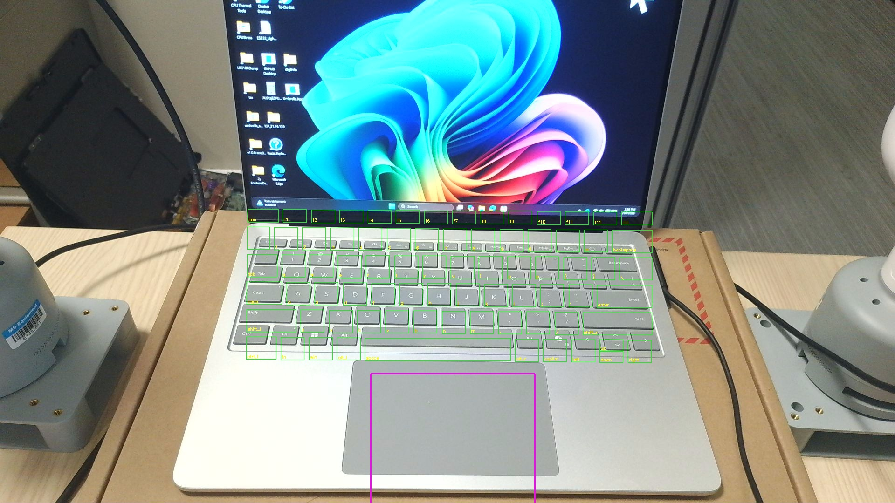

# MyCobotAgent

**Embodied AI Agent for myCobot 280 Pi** — A multi-camera robotic system that can see, understand, and physically interact with devices. Features keyboard typing, touchpad control, voice commands, and vision-language model integration.

## Demos

### Dual-Arm Key Pressing (A, Enter, Z, K)


*Two robot arms working together: left arm presses A, Z and right arm presses Enter, K. Three camera views: overhead RealSense, front RealSense, and workspace overview webcam.*

### XML-Based Key Detection (78 Keys + Touchpad)



*All 78 keys automatically mapped from the Ortler keyboard XML layout. Just click 2 anchor keys in the overhead image — the system computes every key's position using the exact mm geometry from the XML.*

### Keyboard Typing (Fast Mode)


*Types "QWERTYASDFGHZXCVB" across three rows at fast speed. Camera-measured 20.2mm key pitch with QWERTY row stagger correction.*

### Touchpad Interaction


*Swipe down, swipe up, and tap on the laptop touchpad.*

## Features

- **Dual-Arm Coordination** — Two myCobot 280 arms working together, 69 keys across both arms
- **XML Keyboard Layout** — Parse device XML for exact key positions, map all 78 keys from just 2 anchor clicks
- **Multi-Camera Vision** — 2x Intel RealSense D435i (RGBD) + overhead webcam + Pi side camera
- **Voice Control** — Speak commands to control the robot ("type hello", "press A", "dance")
- **50+ Atomic Actions** — Joint/Cartesian motion, jog, servo control, LED, gestures
- **VLM Integration** — Azure GPT-4o for object grounding, visual QA, and action planning
- **MCP Server** — 45+ tools exposed via Model Context Protocol for agentic LLM interaction
- **Action Recording** — Record any action as a multi-camera GIF, returned directly in chat
- **Intelligent Planning** — Decomposes complex requests into sequential atomic actions
- **Drag-and-Teach Calibration** — Teach reference keys by hand, system interpolates the rest

## Architecture

```
┌─────────── Dev Laptop ──────────────────────────────────┐
│                                                           │
│  MCP Server (src/mcp_server.py)                           │
│   ├── 45+ MCP Tools (keyboard, touchpad, vision, etc.)    │
│   ├── Azure GPT-4o (VLM + Agent)                          │
│   └── Dual-Arm Control ─────────────────────┐            │
│                                               │            │
│  Intel RealSense D435i x2 (USB)              │            │
│   ├── Overhead: key annotation + depth        │            │
│   └── Front: device view                     │            │
│                                               │            │
│  Overhead Webcam (USB) — workspace overview   │            │
│  Voice Control (speech recognition)           │            │
└───────────────────────────────────────┼───────┼────────────┘
                                        │       │
                                   Network Switch
                                   ┌────┘       └────┐
                                   │                  │
                      ┌────────────┴───┐  ┌───────────┴────┐
                      │  Left Arm Pi   │  │  Right Arm Pi  │
                      │ 10.105.230.94  │  │ 10.105.230.93  │
                      │ TCP bridge:9000│  │ TCP bridge:9000│
                      │ 33 keys (left) │  │ 36 keys (right)│
                      └────────────────┘  │ Pi webcam:8080 │
                                          └────────────────┘

  [Left Arm]     [Laptop/DUT]     [Right Arm]
    33 keys    78 keys + touchpad    36 keys
```

## Calibration Pipeline

```
Keyboard XML (78 keys in mm positions)
  → Overhead RealSense image + 2 anchor clicks
    → All 78 keys mapped to pixel coordinates
      → Drag-teach ~6 keys per arm
        → Pixel-to-robot affine per arm
          → 69 keys with robot coordinates across both arms
```

## Project Structure

```
MyCobotAgent/
├── config.yaml                 # Robot IPs, camera config
├── requirements.txt            # Python dependencies
├── SKILL.md                    # MCP tool catalog for agents
│
├── annotate_keys.py            # XML anchor-based key annotation GUI
├── map_keys_to_robot.py        # Drag-teach + pixel-to-robot mapping
├── press_key_dual.py           # Dual-arm key pressing
├── press_key.py                # Single-arm key pressing
├── voice_control.py            # Speech-controlled interaction
├── record_demo_v2.py           # 3-camera demo recording
│
├── tcp_serial_bridge.py        # Deploy on Pi: TCP↔serial relay
├── pi_camera_server.py         # Deploy on Pi: webcam MJPEG server
│
├── src/                        # Core library
│   ├── mcp_server.py           # MCP server with 40+ tools
│   ├── cobot/
│   │   ├── actions.py          # 50+ atomic robot actions
│   │   ├── connection.py       # TCP socket connection manager
│   │   ├── camera.py           # Network camera client
│   │   ├── realsense.py        # Intel RealSense D435i integration
│   │   └── config.py           # YAML config loader
│   ├── vlm/
│   │   ├── vlm_client.py       # Azure GPT-4o vision API
│   │   ├── grounding.py        # Object detection post-processing
│   │   └── pipeline.py         # VLM-driven motion pipelines
│   ├── calibration/
│   │   └── eye2hand.py         # Pixel → robot coordinate transform
│   └── agent/
│       ├── planner.py          # LLM-based action planner
│       └── executor.py         # Safe function dispatch
│
├── scripts/                    # Utility scripts
│   ├── calibration/            # Hand-eye calibration tools
│   ├── deploy/                 # Pi setup and deployment
│   ├── debug/                  # Testing and debugging
│   └── recording/              # Demo GIF/video recording
│
├── data/                       # Calibration data and key layouts
│   ├── keyboard_layout.xml     # Ortler keyboard XML (key positions in mm)
│   ├── keyboard_layout_parsed.json  # Parsed XML layout
│   ├── keyboard_dual_arm.json  # Dual-arm key mapping
│   ├── keyboard_vision_detected.json  # Vision-detected key positions
│   └── ...
│
├── temp/                       # Runtime captures (gitignored)
└── visualizations/             # Saved detection visualizations
```

## Quick Start

### 1. Prerequisites

- **2x myCobot 280 Pi** with Raspberry Pi 4 (left + right arms)
- **2x Intel RealSense D435i** (USB, overhead + front)
- Network switch connecting both Pi's to the dev laptop
- Keyboard XML layout file for the target device
- Python 3.10+

### 2. Install

```bash
git clone https://github.com/jiaqizou-msft/MyCobotAgent.git
cd MyCobotAgent
pip install -r requirements.txt
```

### 3. Pi Setup

SSH into the Raspberry Pi and start the services:

```bash
# Start the TCP-serial bridge for robot control
python3 tcp_serial_bridge.py    # listens on port 9000

# Start the camera server
python3 pi_camera_server.py     # listens on port 8080
```

### 4. Configure

Edit `config.yaml` with your Pi's IP address and camera settings.

### 5. Calibrate

Teach reference keys by dragging the robot to each position:

```bash
python scripts/calibration/teach_multicam.py
```

### 6. Use

```bash
# Type on a keyboard (slow/medium/fast)
python press_key.py --fast sad

# Voice control
python voice_control.py

# MCP server (for Claude Desktop or other LLM clients)
python -m src.mcp_server
```

## MCP Tools

The MCP server exposes 45+ tools for agentic control. Key tools:

| Category | Tools |
|----------|-------|
| **Keyboard** | `keyboard_type_text(text, speed)`, `keyboard_press_key(key)` |
| **Touchpad** | `touchpad_swipe(direction)`, `touchpad_tap(x, y)` |
| **Recording** | `record_action(action)` — executes action + returns GIF in chat |
| **Motion** | `robot_home()`, `robot_send_coords()`, `robot_finger_touch()` |
| **Gestures** | `robot_head_dance()`, `robot_head_shake()`, `robot_head_nod()` |
| **Vision** | `realsense_capture()`, `vlm_ask_question()`, `camera_capture()` |
| **Agent** | `agent_execute(instruction)` — LLM plans + executes multi-step actions |

See [SKILL.md](SKILL.md) for the full tool catalog, action planning rules, and decomposition examples.

### Claude Desktop Integration

```json
{
  "mcpServers": {
    "mycobot": {
      "command": "python",
      "args": ["-m", "src.mcp_server"],
      "cwd": "C:\\Users\\jiaqizou\\MyCobotAgent"
    }
  }
}
```

## Voice Commands

| Command | Examples |
|---------|----------|
| **Press key** | "press A", "hit D" |
| **Type text** | "type hello", "type sad" |
| **Go home** | "go home", "reset" |
| **Gestures** | "dance", "shake", "nod" |
| **LED** | "led red", "color blue" |
| **Status** | "status" |
| **Stop** | "stop" |

## Camera System

| Camera | Mount | Purpose |
|--------|-------|---------|
| **RealSense D435i** | Overhead (laptop USB) | RGBD for depth + detection |
| **Side webcam** | Pi (network stream) | Device-under-test view |
| **Overview cam** | Laptop USB | Full workspace monitoring |

## License

MIT
