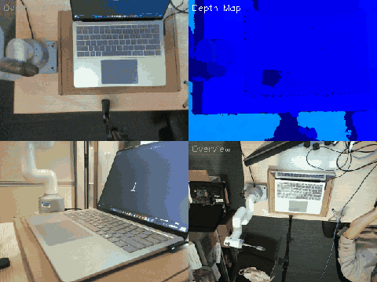
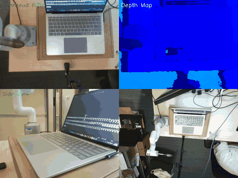

# MyCobotAgent

**Embodied AI Agent for myCobot 280 Pi** — A multi-camera robotic system that can see, understand, and physically interact with devices. Features keyboard typing, touchpad control, voice commands, and vision-language model integration.

## Demos

### Keyboard Typing (Fast Mode)



*Types "QWERTYASDFGHZXCVB" across three rows at fast speed. Camera-measured 20.2mm key pitch with QWERTY row stagger correction.*

### Touchpad Interaction



*Swipe down, swipe up, and tap on the laptop touchpad. The finger maintains consistent contact pressure throughout the gesture.*

## Features

- **Keyboard Interaction** — Auto-calibrated QWERTY key pressing with sub-key precision
- **Multi-Camera Vision** — Intel RealSense D435i (RGBD overhead), side webcam, workspace overview
- **Voice Control** — Speak commands to control the robot ("type hello", "press A", "dance")
- **50+ Atomic Actions** — Joint/Cartesian motion, jog, servo control, LED, gestures
- **VLM Integration** — Azure GPT-4o for object grounding, visual QA, and action planning
- **MCP Server** — 40+ tools exposed via Model Context Protocol for agentic LLM interaction
- **Drag-and-Teach Calibration** — Teach reference keys by hand, system interpolates the rest

## Architecture

```
┌─────────── Dev Laptop ──────────────────────────┐
│                                                   │
│  MCP Server (src/mcp_server.py)                   │
│   ├── Robot Actions API (50+ functions)           │
│   ├── Azure GPT-4o (VLM + Agent)                  │
│   └── MyCobot280Socket ──── TCP:9000 ─────┐      │
│                                             │      │
│  Intel RealSense D435i (USB)                │      │
│   └── Overhead RGBD capture                 │      │
│                                             │      │
│  Voice Control (speech_recognition)         │      │
│  Overview Camera (USB webcam)               │      │
└─────────────────────────────────────┼───────┼──────┘
                                      │       │
                                 Ethernet Link
                                      │       │
┌─────────────────────────────────────┼───────┼──────┐
│         Raspberry Pi (on robot)     │       │      │
│                                     ▼       ▼      │
│  Side-View Webcam (port 8080)       │       │      │
│   └── MJPEG stream + snapshots      │       │      │
│                                             │      │
│  TCP-Serial Bridge (port 9000) ◄────────────┘      │
│   └── pymycobot → myCobot servos                   │
└─────────────────────────────────────────────────────┘
```

## Project Structure

```
MyCobotAgent/
├── config.yaml                 # Robot IP, camera config, API settings
├── requirements.txt            # Python dependencies
├── press_key.py                # Keyboard key pressing (main tool)
├── voice_control.py            # Voice-controlled robot interaction
├── device_interactor.py        # Auto keyboard/touchpad detection via RGBD
├── keyboard_presser.py         # Keyboard detection + pressing pipeline
├── vision_presser.py           # Vision-guided pressing with visual servoing
├── tcp_serial_bridge.py        # Deploy on Pi: TCP↔serial relay for robot
├── pi_camera_server.py         # Deploy on Pi: webcam MJPEG server
├── pi_dual_camera_server.py    # Deploy on Pi: RealSense + webcam server
│
├── src/                        # Core library
│   ├── mcp_server.py           # MCP server with 40+ tools
│   ├── cobot/
│   │   ├── actions.py          # 50+ atomic robot actions
│   │   ├── connection.py       # TCP socket connection manager
│   │   ├── camera.py           # Network camera client
│   │   ├── realsense.py        # Intel RealSense D435i integration
│   │   └── config.py           # YAML config loader
│   ├── vlm/
│   │   ├── vlm_client.py       # Azure GPT-4o vision API
│   │   ├── grounding.py        # Object detection post-processing
│   │   └── pipeline.py         # VLM-driven motion pipelines
│   ├── calibration/
│   │   └── eye2hand.py         # Pixel → robot coordinate transform
│   └── agent/
│       ├── planner.py          # LLM-based action planner
│       └── executor.py         # Safe function dispatch
│
├── scripts/                    # Utility scripts
│   ├── calibration/            # Hand-eye calibration tools
│   ├── deploy/                 # Pi setup and deployment
│   ├── debug/                  # Testing and debugging
│   └── recording/              # Demo GIF/video recording
│
├── data/                       # Calibration data and key layouts
│   ├── keyboard_taught.json    # Taught key positions
│   ├── calibration_realsense.json  # RealSense-to-robot transform
│   └── ...
│
├── temp/                       # Runtime captures (gitignored)
└── visualizations/             # Saved detection visualizations
```

## Quick Start

### 1. Prerequisites

- **myCobot 280 Pi** with Raspberry Pi 4
- **Intel RealSense D435i** (USB, mounted overhead)
- Ethernet connection between laptop and Pi
- Python 3.10+

### 2. Install

```bash
git clone https://github.com/jiaqizou-msft/MyCobotAgent.git
cd MyCobotAgent
pip install -r requirements.txt
```

### 3. Pi Setup

SSH into the Raspberry Pi and start the services:

```bash
# Start the TCP-serial bridge for robot control
python3 tcp_serial_bridge.py    # listens on port 9000

# Start the camera server
python3 pi_camera_server.py     # listens on port 8080
```

### 4. Configure

Edit `config.yaml` with your Pi's IP address and camera settings.

### 5. Calibrate

Teach reference keys by dragging the robot to each position:

```bash
python scripts/calibration/teach_multicam.py
```

### 6. Use

```bash
# Type on a keyboard
python press_key.py sad

# Voice control
python voice_control.py

# MCP server (for Claude Desktop or other LLM clients)
python -m src.mcp_server
```

## Voice Commands

| Command | Examples |
|---------|----------|
| **Press key** | "press A", "hit D" |
| **Type text** | "type hello", "type sad" |
| **Go home** | "go home", "reset" |
| **Gestures** | "dance", "shake", "nod" |
| **LED** | "led red", "color blue" |
| **Status** | "status" |
| **Stop** | "stop" |

## Camera System

| Camera | Mount | Purpose |
|--------|-------|---------|
| **RealSense D435i** | Overhead (laptop USB) | RGBD for depth + detection |
| **Side webcam** | Pi (network stream) | Device-under-test view |
| **Overview cam** | Laptop USB | Full workspace monitoring |

## License

MIT
